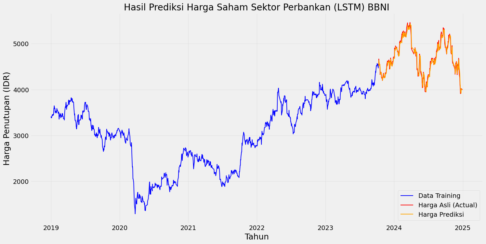
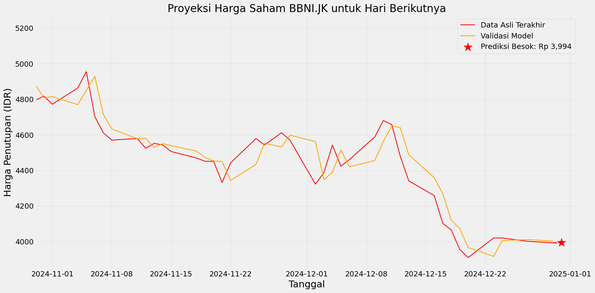

# Final Project Kecerdasan Buatan: Prediksi Harga Saham (BBNI.JK)
**Tema:** Sequence Modelling  
**Metode:** Deep Learning - Long Short-Term Memory (LSTM)

Proyek ini merupakan implementasi teknik **Kecerdasan Buatan** untuk memprediksi harga saham harian PT Bank Negara Indonesia (Persero) Tbk (**BBNI.JK**) menggunakan algoritma LSTM.

---

## 👥 Anggota Kelompok 4
1. **23.11.5437** | Tor Fatah Onggara Lubis
2. **23.11.5435** | Mukti Cahyo Pamungkas
3. **23.11.5410** | Attila Arya R Patadjenu

---

## 🏗️ Arsitektur Model
Model dibangun menggunakan framework **TensorFlow/Keras** dengan rincian lapisan sebagai berikut:

* **Input Layer**: Data *sequence* dengan panjang 60 hari.
* **LSTM Layer 1**: 50 unit dengan `return_sequences=True`.
* **Dropout 1**: Rate 0.2 untuk mencegah *overfitting*.
* **LSTM Layer 2**: 50 unit dengan `return_sequences=False`.
* **Dropout 2**: Rate 0.2.
* **Dense Layer**: 25 unit sebagai lapisan penghubung.
* **Output Layer**: 1 unit untuk prediksi harga penutupan.

---

## 📊 Hasil dan Evaluasi
Model dilatih selama 200 *epoch* dan menghasilkan performa yang akurat:
* **Skor RMSE**: **85.42**

### 1. Grafik Validasi Model
Perbandingan data training, harga aktual, dan hasil prediksi model.

### 2. Proyeksi Harga Masa Depan
Prediksi untuk hari kerja berikutnya (Januari 2025) sebesar **Rp3.994**.

---
